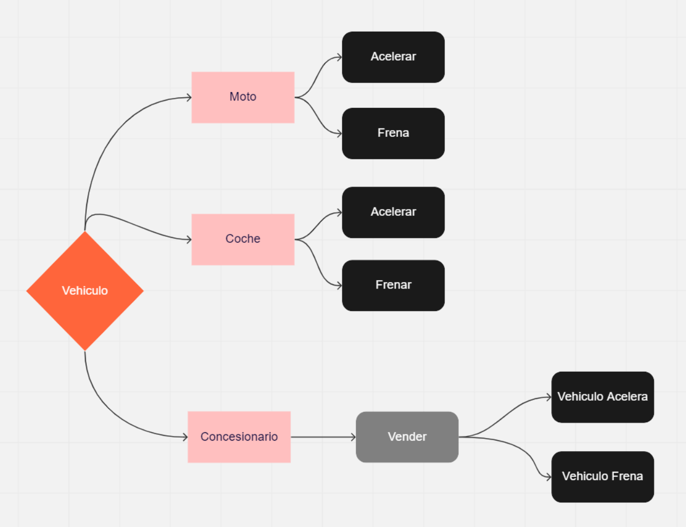
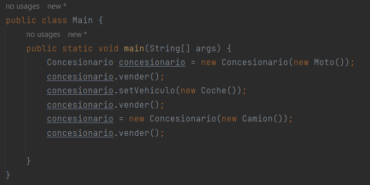

# PildoraDIP

El principio D de SOLID, también conocido como Principio de Inversión de Dependencias (Dependency Inversion Principle, DIP), es uno de los cinco principios que conforman la metodología SOLID para el diseño de software orientado a objetos.

Este principio establece que los módulos de alto nivel no deben depender de módulos de bajo nivel. En lugar de eso, ambos deberían depender de abstracciones. En otras palabras, los detalles de implementación de los módulos de bajo nivel no deben ser conocidos por los módulos de alto nivel, sino que deben ser proporcionados a través de interfaces abstractas.

Este principio ayuda a garantizar que los cambios en los módulos de bajo nivel no afecten a los módulos de alto nivel, lo que aumenta la flexibilidad y la modularidad del código. Además, este principio también fomenta el uso de interfaces y clases abstractas en lugar de clases concretas, lo que permite una mayor reutilización de código y una menor dependencia de implementaciones específicas.

## Ejemplo sin el uso de Inversión de Dependencias.
En el ejemplo de la carpeta 'NoD' vemos como la clase Concesionario depende directamente de las clases Moto y Coche. En los métodos venderMoto y venderCoche, la clase Concesionario crea una instancia de Moto o Coche, respectivamente, y llama a los métodos acelerar y frenar en esa instancia.

Este enfoque no utiliza la inversión de dependencias, lo que hace que el código sea menos flexible y más difícil de mantener. Si quisieras agregar un nuevo tipo de vehículo, tendrías que modificar directamente la clase Concesionario, lo que puede provocar errores y aumentar el tiempo de desarrollo.

## Ejemplo usando Inversión de Dependencias.

En el ejemplo de la carpeta 'D' vemos como la interfaz Vehiculo representa el concepto de vehículo y tanto la clase Moto como la clase Coche implementan esta interfaz. La clase Concesionario depende de la interfaz Vehiculo en lugar de depender directamente de las clases Moto y Coche.

De esta manera, podemos pasar un objeto Moto o un objeto Coche al constructor de la clase Concesionario, lo que nos permite cambiar el tipo de vehículo que se vende sin tener que modificar la clase Concesionario en sí misma. Además, si quisiéramos agregar un nuevo tipo de vehículo, solo tendríamos que crear una clase que implemente la interfaz Vehiculo.

## Creamos una nueva Clase Camion e instanciamos.
Ahora sería asi de sencillo implementar un nueva clase.
Ahora creamos la Clase Camion, que implementa la interfaz Vehiculo y proporciona implementaciones para los métodos acelerar y frenar. Luego, creamos una nueva instancia de la Clase Concesionario que utiliza la Clase Camion como vehículo y llamamos al método 'vender' en la instancia del concesionario.

De esta manera, podemos agregar fácilmente un nuevo tipo de vehículo a nuestro sistema simplemente creando una clase que implemente la interfaz Vehiculo y usándola en la clase Concesionario sin tener que modificar ninguna otra parte del código.

